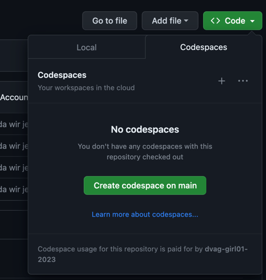
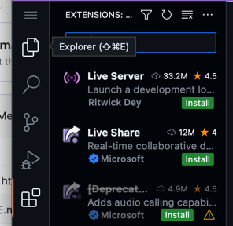
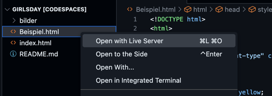

# DVAG Girlsday 2023

## Github Zugänge 
Jeder Teilnehmer*in erhält einen eigenen Github Zugang. 
Die sind alle durchnummeriert von 01 - 08

https://github.com/dvag-girl0[1-8]-2023/girlsday
- Benutzername: dvag-girl0[1-8]-2023
- Benutzername: girlsday2023

Sobald der Stand commited wird, ist das Ergebnis unter der
jeweiligen Githup Page erreichbar. Hier wieder die richtige Girl Nummer ersetzen.
https://dvag-girl0[1-8]-2023.github.io/girlsday/

Also Girl06 hat folgende Urls: 

* [Github Account](https://github.com/dvag-girl06-2023/girlsday)
* [Github Page](https://dvag-girl06-2023.github.io/girlsday/)
* [Beispiel Kuchenrezept](https://dvag-girl06-2023.github.io/girlsday/Beispiel.html)

Es sind also gesamt 8 Zugänge angelegt, die dann auch von den Teilnehmenden behalten werden können. 

Innerhalb dieser Github Umgebungen wird dieses Projekt gecloned und kann dort angepasst werden von den Teilnehmenden.

## Code Space 
Die Teilehmenden können am einfachsten direkt in Github mittels des angelegten und konfigurierten CodeSpace arbeiten. 
Dort ist eine direkte Preview eingebaut, so dass man direkt experimentieren kann. 

### Anlegen / Starten
Wenn noch kein CodeSpace angelegt wurde einfach 


### Extensions Installieren
LiveServer für Preview der HTML Dateien


### Preview der Seite im Browser
Die gerade bearbeitete Datei im LiveServer öffnen und das Browserfenster 
geöffnet lassen


Jede Änderung an der Datei im CodeSpace kann direkt in diesem Browser Fenster betrachtet werden. 
Also einfach mal die Farbe anpassen von *yellow* nach *green* etwa. 

In _Beispiel.html_ 
```html
.hintergrund {
		background-color: yellow; 
		margin-right: auto; 
		marign-left:auto
	}
```
durch 
```html
.hintergrund {
		background-color: green; 
		margin-right: auto; 
		marign-left:auto
	}
```
ersetzen.


